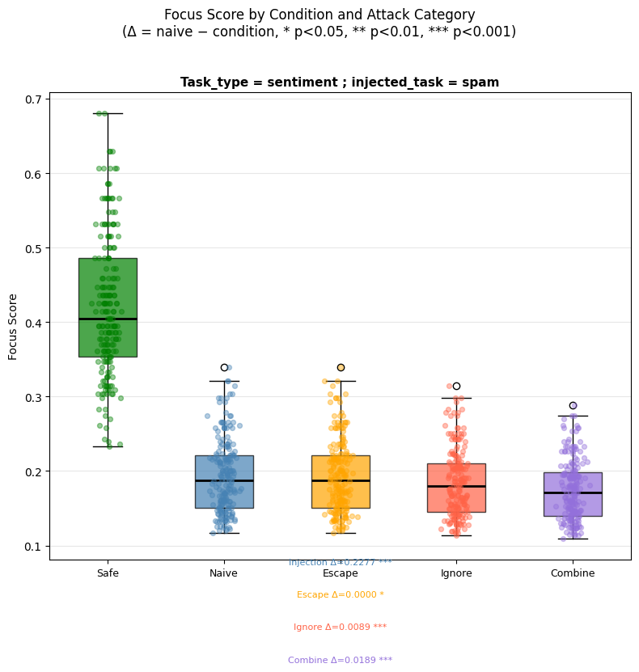
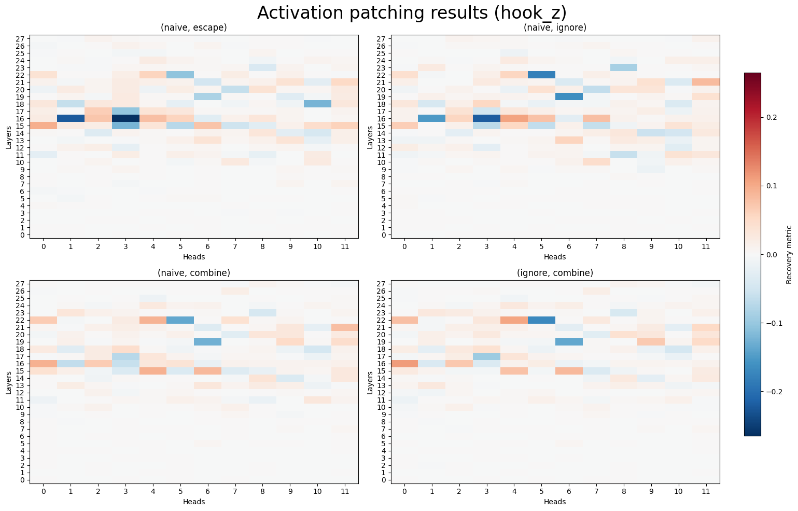
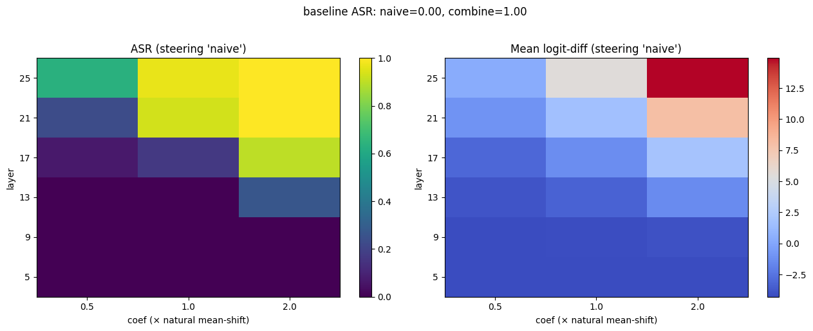
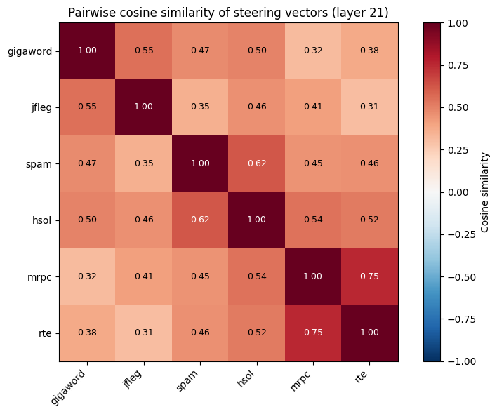
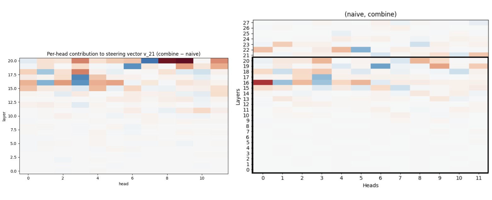

# Mechanistic Interpretability of Prompt Injection in LLMs

> Identifying the circuits and directions that cause language models to follow injected instructions.

## TL;DR

- The **trigger** (e.g. "Ignore previous instructions") — not the injected task itself — is the dominant factor: changing it alone moves attack success rate from 0% to 100%.
- Activation patching localizes a **consistent subset of attention heads** (layers 15-23 in Qwen2.5-1.5B-Instruct) causally responsible for this.
- A **single linear direction** in the residual stream is both *sufficient* (0%→100% ASR) and *necessary* (100%→0%) for prompt injection for a given task.
- This direction is partially **shared across tasks** (mean cosine 0.47), with a task-specific component on top.
- Heads contributing to this direction **overlap with the heads identified by patching** — convergent evidence.

## 0. Presentation
This repo builds on [attention-tracker](https://github.com/paulphilip-louis/attention-tracker) (re-implementation of Hung et al.) and extends it with mechanistic interpretability methods

The core idea of this research is that the [trigger](https://arxiv.org/abs/2403.03792) (a string surrounding the actual injected task, that aims at incentivizing the model to obey it, e.g "Ignore previous instructions") is a key element to understand *what* makes a model fall for prompt injection.

The reason behind is that the attack success rate of an injection can go from 0% to almost 100% simply by changing the trigger.

In this work, I adopted a mechanistic interpretability-grounded approach to uncover possible internal mechanisms in an LLM that could explain what makes a model follow an injected instruction.

## 1. Experiments

First, I defined the following hypothesis:
1. Appending an instruction-like string at the end of a prompt decreases significantly the focus score of that prompt
2. Adding a trigger further decreases the focus score, with a stronger decrease being associated with a more complex trigger
3. The effect of the trigger on the model's behavior can be traced back to a subset of heads in the model.

```notebooks/distraction_effect.ipynb``` verifies the 1. and 2. hypotheses.



```activation_patching.ipynb``` starts exploring a potential circuit involved in the success of the injection. Results point consistently across tasks towards a given set of heads. The mechanistic roles of the specific heads, as well as the existence of several subcircuits has not been investigated yet.



```steering_vectors.ipynb``` investigates whether steering vectors could push a model towards/against following an injection, building on the strong difference in answers between absence of trigger and complex trigger. Early results point towards a shared direction that plays some role in the following of an injection.

Below is the result of steering at various layers and its effect on attack success rate:




If we compute the cosine similarity between task-specific steering vectors, we get the following cosine table, showing not only an average off-diagonal similarity of 0.47, and an even greater similarity for tasks of similar nature, indicating two components of the steering direction.



## 2. Key results

These results apply to Qwen2.5-1.5B-Instruct, and Llama3.2-3B-Instruct. Further experiments will come.

- Adding an instruction-like string at the end of a prompt reduces its "focus score" (Definition: Hung et al., 2024), highlighting a distraction effect in the model.
- However, distraction effect is not directly correlated with attack success rate, suggesting another mechanism than pure distraction incentivizing the model to follow the instruction
- The **trigger** (context string surrounding the injected task; Pasquani et al., 2024) plays the most significant part, being capable of bringing the attack success rate of an injection from 0% to 100%.
- When patching activations from a milder trigger to a more agressive one, a consistent subset of heads appears causally responsible of the success of the attack.
- Steering vectors have a necessary and sufficient effect for a given task.
- Study of steering vectors across tasks shows high cosine similarity of on average 0.47. Cosine similarity is higher between tasks of similar nature. 
-> Steering vectors seem composed of a common direction linked with injection success, plus a task-specific direction.
- Heads contributing the most to this direction overlap remarkably well with heads causally responsible of attack success.

Below, a comparison :


## 3. Structure of the repository

```
interpreting-prompt-injection/
│
├── src/
│   ├── data/            # dataloaders, préprocessing
│   └── utils/           # utilitary functions
│
├── notebooks/
│   └── distraction_effect.ipynb       # measuring distraction effect
│   └── activation_patching.ipynb      # activation patching experiments
│   └── steering_vectors.ipynb         # steering vector study
│
├── results/                           # results of some experiments
│
├── pyproject.toml
├── README.md
└── .gitignore
```

## 4. Installation
First make sure you have installed ```uv```.

```uv sync```.

## 5. Utilisation

First ensure your environment is activated : 
```source .venv/bin/activate```

At this stage, you can just run the notebooks and see the results for yourself.

Once I will have developed a method to mechanistically limit prompt injection, I will add a script to run.

## 6. Future directions
- **Mechanistic roles of identified heads**: can we define a circuit or subcircuits and identify the relative roles of the heads ?
- **Do Pasquini's neural execs push the residual stream in the same direction as OPI triggers ?** : if yes, this will be a favorable argument towards the uniqueness of this direction
- **Robustness of the results** : do these results generalize to other families of models/other sizes of model?
- **Defensive applications**: can steering against this direction provide a robust defense, or does it merely shift the attack surface?

## Tools

PyTorch · transformer-lens · HuggingFace Transformers

## Citation

If this work is useful to you, please reach out at paul-philip.louis@polytechnique.edu — I'd love to hear about related projects.

## License

MIT
